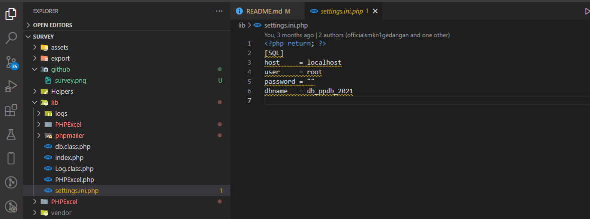
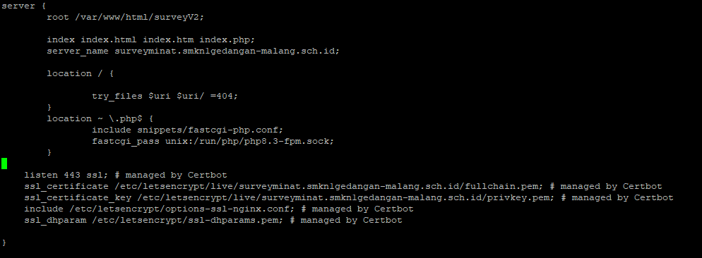

# psb_system
Sistem pendaftaran dan penerimaan siswa baru sekolah.

## I assume that your server already has a configuration regarding database and nginx so the tutorial below is made concisely/brief. 
## If you want a complete tutorial please visit https://github.com/smkn1gedangan/smknega

## requirement / dibutuhkan
- php8.3 ,Composer, and some library supporters like vlucas

###### For Install Web Server
-   **apt install nginx**

###### For Install PHP and Exstension Requirement
-   **apt install php8.3**

###### For Install Composer
-   **curl -sS https://getcomposer.org/installer | php**

###### For Move Composer
-   **mv composer.phar /usr/bin/composer**

###### For Get A Version Composer
-   **composer --version**

###### For Install DBMS
-   **apt install mysql-server**

## application installation
- **git clone https://github.com:smkn1gedangan/survey.git survey(optional name)**

###### For Go To New Directory
-   **cd survey**

###### For Installing Dependency Composer
- **composer install** 

###### For Autoload Php
- **composer dump-autoload** 

###### For Copy .env.example to .env
- **cp .env.example .env** 

###### make sure lib/settings.php same as your database
-   

###### If everything is finished, make sure the nginx configuration is as below
-   
